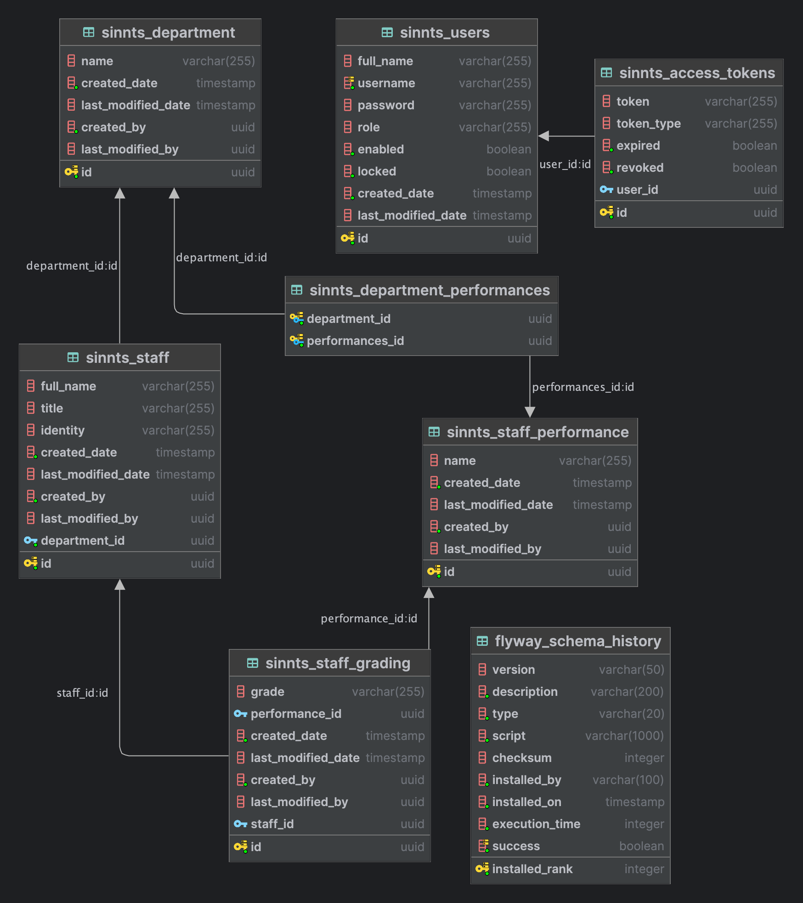

# SINNTS Staff Performance and Evaluation Grading System 

<hr/>

## Todo:

<hr/>

## Done:

- [x] Performance CRUD
- [x] Department CRUD
- [x] Add Performance to Department
- [x] Remove Performance to Department
- [x] Staff CRUD
- [x] Add Staff to Department
- [x] Change Staff Department
- [x] Get Staff Department
- [x] Get Department Performances
- [x] Get Department Performances By Staff
- [x] Grade Staff
- [x] Get Staff Gradings
- [x] Update Staff Grading
- [x] Added Super Admin Role and Permissions
- [x] Create Super Admin if Not Exists at the First Run

<hr />

## Database Schema



<hr/>

## Get Started at Local Environment

* Requirements
    - You must have JDK17+ installed
    - You must have Docker installed
    - You must set the Required Environment variables
 ```
DB_PASSWORD=YourDBPassword
DB_URL=YourDBURL
DB_USERNAME=YourDBUsernName
JWT_EXPIRY=JWTAccessTokenExpiry
JWT_SECRET_KEY=JWTSecretKey
PORT=ServerPort
REFRESH_TOKEN_EXPIRY=JWTRefreshTokenExpiry  
  
```
  

* Clone the repository using

```
 git clone https://github.com/Dhannun/SpringSecurity6.git
```

* Created a Docker Container for you DB by running the command below, make sure you are in teh root folder where the `docker-compose.yml` file is located
```yaml
docker compose up -d
```

* Build the project: mvn clean install
* Run the project: mvn spring-boot:run

-> The application will be available at http://localhost:2024/api/v1.
